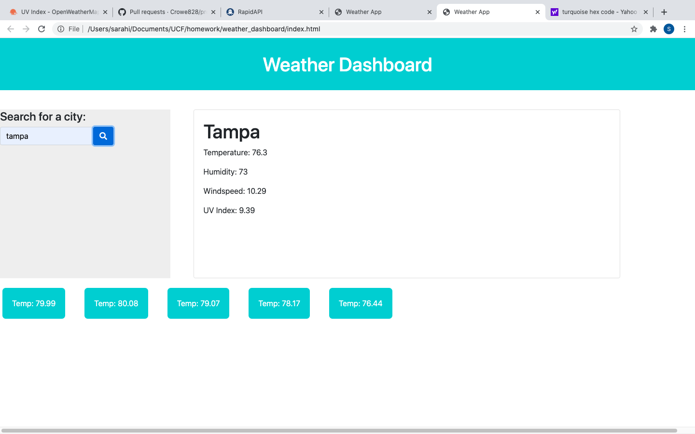

# weather_dashboard

## Description 

This application is a weather dashboard that finds the weather conditions of any city in the world. It provides you with the current weather data and a five-day forecast. The webpage also shows your recent search cities using local storage. The webpage was created using jQuery,javascript,html, and css. I have used the Open Weather API to retrieve the data. The current weather section displays the following:
-The city
-The temperature
-The Humidity
-The UV speed
-Wind speed
-The date

While the 5-day forecast includes:
-Icon pictures
-Temperature
-Humidity 
-Date

## Installation

There are no installations required. It will simply open up in a browser window.

Here is a link to the webpage:
 https://irasar.github.io/weather_dashboard/

## Usage 

## Credits
https://getbootstrap.com/docs/4.5/getting-started/introduction/

https://openweathermap.org/api/

https://fontawesome.com/

